# Streamlit APP

In order for the users to use our model for MBTI personality prediction, we deployed an online APP using Streamlit, which contains four sections:
* Demo
* EDA
* BERT-Model
* Training

## Demo
This is the main part where the users can test the MBTI personality reflected by the input text.
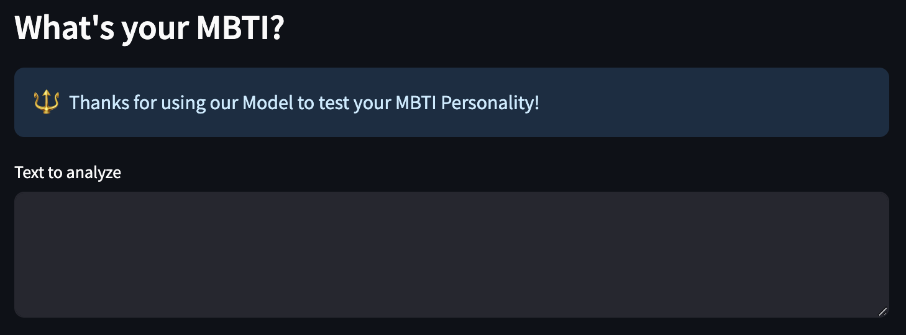

After the user has provided the input text in the box, our model will run and generate the **top 3 most likely MBTI personality types**, as suggested by the text input. The only requirements for the input text is to be written by the person and expressive. Longer input would likely yield a better result, as the phrase "Good Morning" along would have limited information to tell much about MBTI personality -- though our model will still do its job to suggest top 3 predictions.

For illustration purpose, we tried to put a quote from Shakespeare's *Hamlet*
> Doubt thou the stars are fire;
> Doubt that the sun doth move;
> Doubt truth to be a liar;
> But never doubt I love.

Then, our model will start to run and provide 3 most likely MBTI predictions.

It turns out our model gives *ESFJ* as the most likely MBTI personality for the quote!
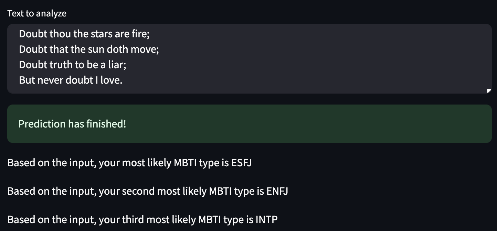

Finally, we provide short descriptions to each of the top 3 predicted personality type, along with external links to the 16personality website, which has more comprehensive introduction to each personality type.
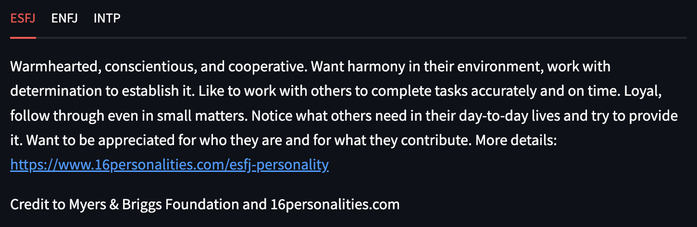

## EDA
We dedicated a small section describing the EDA results.
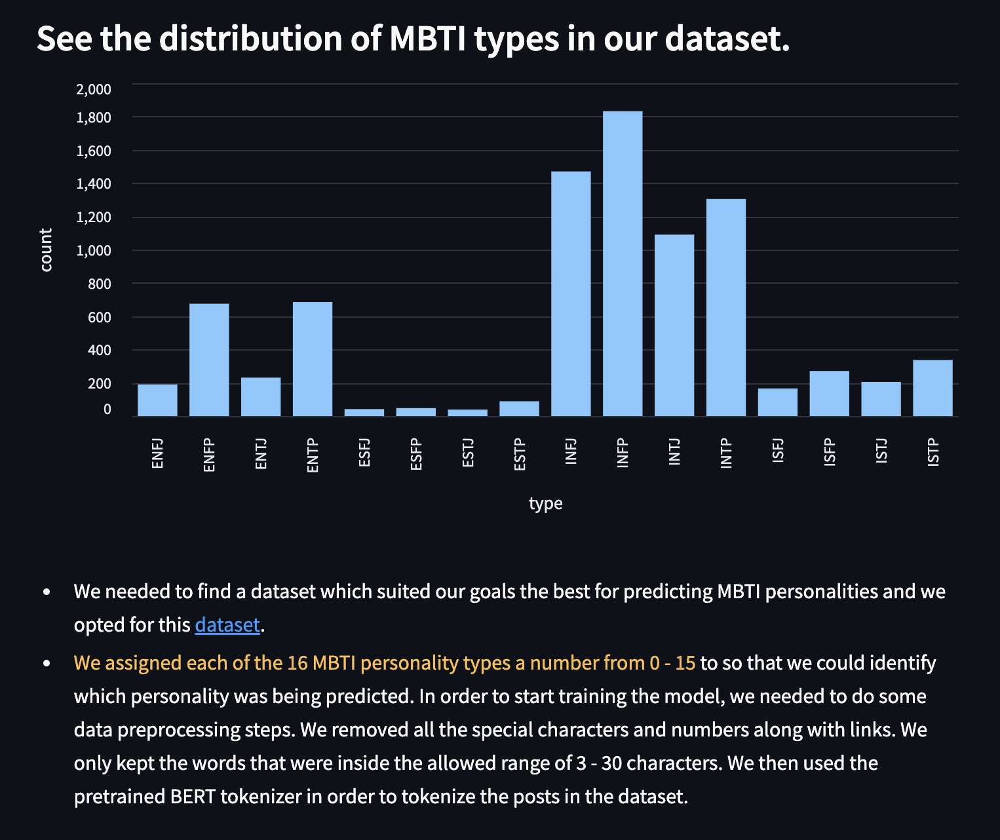

## BERT-Model
Then, we discussed a little bit about the BERT model, which we used for transfer learning.
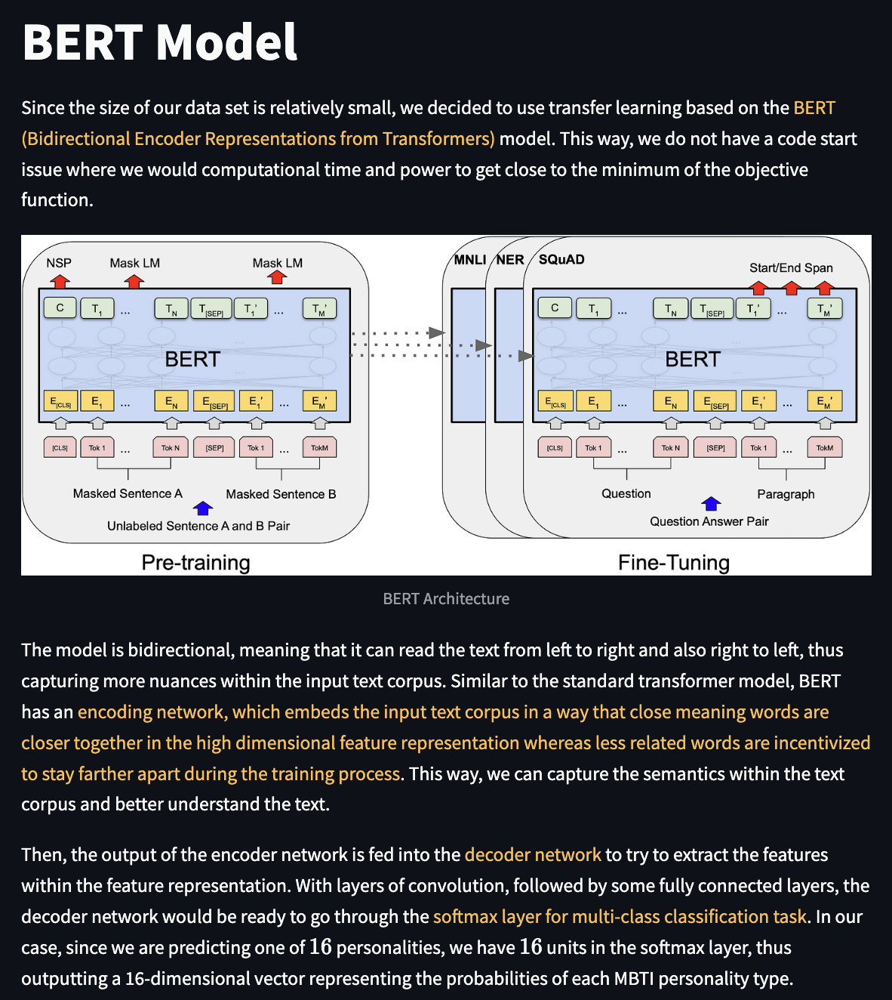

## Training
To give a more comprehensive picture of the project, we described our training process, too.
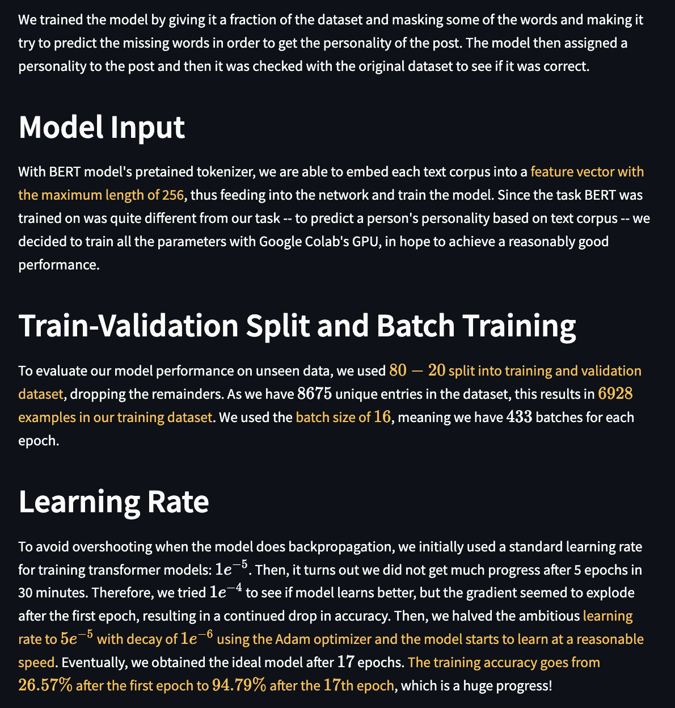

Also, the accuracies after each epoch are presented:
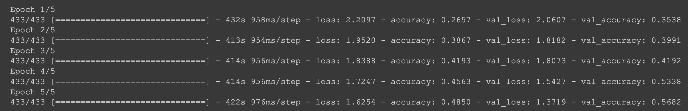

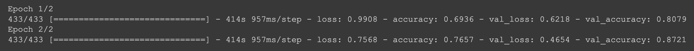
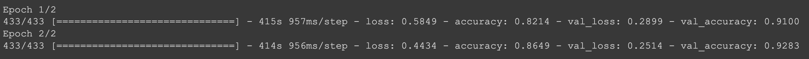
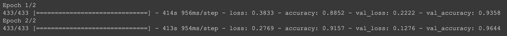
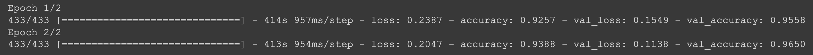
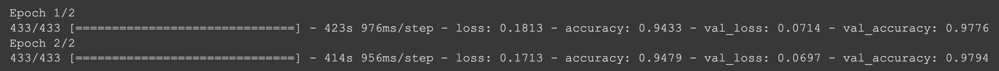